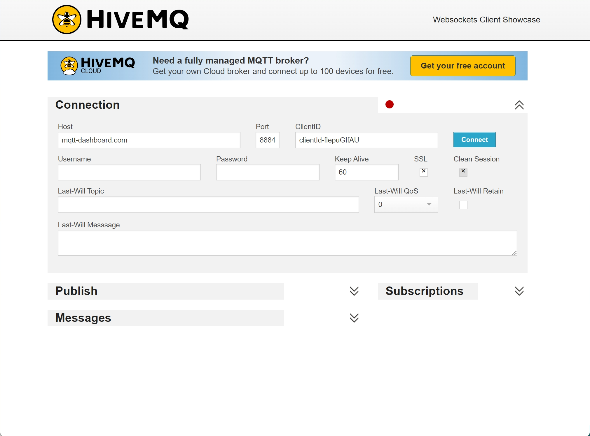

# HiveMQ Websocket Client - User Manual

The HiveMQ Websocket Client is a simple tool for testing MQTT message subscriptions and publishing. This guide will help you connect to the client, subscribe to topics, and publish messages.

## URL to Access
Visit the client at [HiveMQ Websocket Client](https://www.hivemq.com/demos/websocket-client/).

---

## Steps to Use the MQTT Client

### 1. Connect to the MQTT Broker
1. **Enter Connection Details**:
   - **Host**: Use the broker `06a68c084516440da5d6c84b6514ed49.s1.eu.hivemq.cloud`.
   - **Port**: The default port is `8884` (for SSL-enabled Websocket Port connection). No need to change. 
   - **ClientID**: Auto-generated by default. You can replace it with your unique identifier.
   - **Username and Password**: Test username would be `webui` and password would be `1qaz@WSX`.
   - **Keep Alive**: Default is `60` seconds. This defines the interval for sending PING messages. No need to change. 
   - **SSL**: Check this box to enable an encrypted connection. No need to change. 

2. **Connect**:
   - Click the **Connect** button to establish a connection with the broker.
   - A successful connection will display a red indicator turning green.

---

### 2. Subscribe to a Topic (Getting status from the farm kit)
1. Expand the **Subscriptions** section. Click on `Add New Topic Subscription` button
2. Enter the topic name in the text field.
   - Use `#` to subscribe to all topics or enter specific topic like  `farm/esp32_01/pir/state` according to our MQTT protocol.
   - Set QoS level to `0` since our ESP32 kit only support this.
3. Click the **Subscribe** button.
4. Messages for the subscribed topic(s) will appear in the **Messages** section.

---

### 3. Publish a Message (Controlling the farm kit)
1. Expand the **Publish** section.
2. Enter the topic name in the **Topic** field.
   - Example: `farm/esp32_01/servo/cmd`.
3. Write your message in the **Message** field. Should be a valid JSON object. 
   - Example: `{ "position": "OPEN" }`
4. Set the **QoS** level 0 since our ESP32 kit only support this.
5. Click the **Publish** button to send the message.

---

### 4. View Messages
1. Expand the **Messages** section to see incoming messages from the subscribed topics.
2. Each message will display the **Topic** name, **QoS**, and the message content.

---

## Notes
- The wildcard topic `#` can be used to subscribe to all topics for testing.
- Ensure you use an active internet connection to communicate with the broker.
- Refresh the page if you encounter connectivity issues.

Enjoy testing your MQTT applications with the HiveMQ Websocket Client!