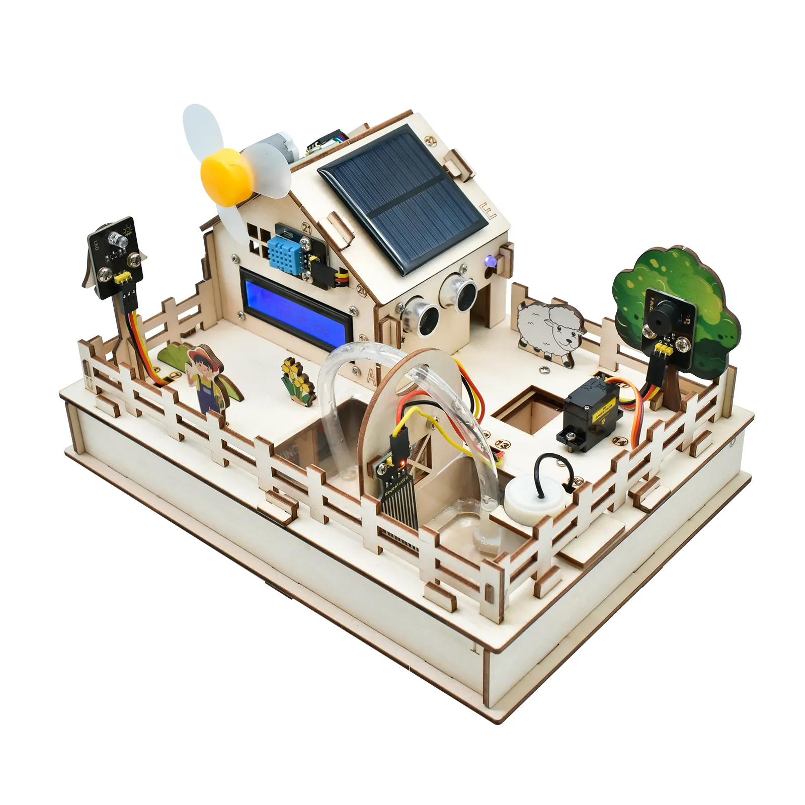
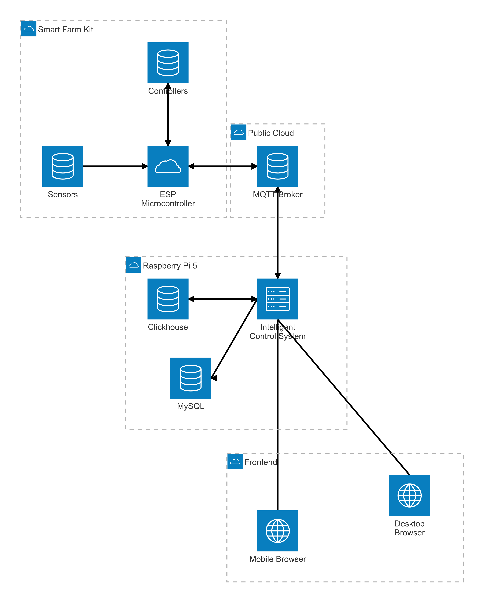

# IoT-Enabled Smart Farm Management System Proposal

Group 2:

- Molin Wan, 400610032
- Harmanpreet Multani, 400614352
- Yifei Zhou, 400588576
- Saiteja Reddy Chennuru, 400488267

Date: Nov 2, 2024

## Problem Statement
Traditional farming systems require constant human monitoring and manual intervention, leading to inefficient resource allocation and potential delays in responding to critical environmental changes. Farmers need to be physically present to monitor conditions and adjust controls, making it difficult to manage multiple locations or respond to issues during off-hours. The lack of automation and remote monitoring capabilities results in increased labor costs, reduced operational efficiency, and potential crop losses due to delayed responses to environmental changes.

## Proposed Solution

We propose developing a smart farming system using the Keyestudio ESP32 IoT Control Smart Farm Starter Kit. Farm stakeholders will have access to various monitoring metrics and can control farm components such as switches and relays through the system. By leveraging cloud services (i.e., AWS IoT Core), the system will minimize human intervention through intelligent automation, remote monitoring, and control capabilities. We will also implement enhanced security techniques for the MQTT protocol to ensure secure data transmission between system components.

## System Architecture and Methodology

### Hardware Components
1. **Keyestudio ESP32 IoT Control Smart Farm Starter Kit**
   - Temperature and Humidity Sensor for environmental monitoring
   - Soil Humidity Sensor for irrigation control
   - Ultrasonic Module and PIR Motion Sensor for livestock movement detection
   - Solar Panel for power generation monitoring
   - Photoresistor for light level detection
   - Water Level Sensor for irrigation system monitoring

2. **Raspberry Pi 5**
   - Acting as a virtual private server
   - Hosting local database system for data storage and analysis
   - Running Intelligent Control System (ICS)

### Software Components
1. **MQTT Broker Service**
   - Using public infrastructure (e.g. AWS IoT Core) as MQTT protocol broker
   - Secure message routing and device management
   - Built-in security features and experimental security features in collaboration with Prof. Tondo

2. **Data Collection and Control**
   - Runs on ESP32 microcontroller with Internet connectivity
   - Real-time sensor data acquisition through wired interfaces (i.e., GPIO)
   - Apply control commands through wired interfaces (i.e., GPIO)
   - MQTT protocol based bidirectional communication between endpoints and cloud

3. **Intelligent Control System (ICS)**
   - Runs on Raspberry Pi with Internet connectivity
   - Stream processing capability
   - Historical data storage and analysis
   - Rule-based automation engine

4. **Front End: User Interface**
   - Web-based dashboard (React.js or similar technologies)
   - Easy and intuitive control
   - Simple user authentication
   - Real-time and historical data display
   - Rule-based automation creation and management

## Implementation Plan

1. **Phase 1: Hardware Setup and Architectural Design**
   - Hardware Kit setup: Sensor array installation, hardwiring, components power-on tests
   - ESP32 configuration and testing
   - Basic MQTT connectivity implementation and testing
   - Intelligent Control System architecture design
   - Web interface prototype design
   - Database schema design

2. **Phase 2: Core Software Development**
   - ESP32 Data Collection and Control code writing
   - Web interface development
   - ICS basic module implementation (i.e., Rule-based Automation engine, user authentication, historical data processing with cache)

3. **Phase 3: Security Implementation and Testing**
   - Comprehensive system testing and optimization
   - MQTT security feature implementation
   - Security testing and validation
   - Finalizing project report and presentation

## Expected Outcomes

1. Fully assembled Smart Farm Starter Kit (with process pictures/videos).
2. Real-time monitoring and historical data display system with intuitive user interface with user authentication.
3. Manual control and rule-based automated control capabilities.
4. Implementation of advanced MQTT security features and experimental security protocols in collaboration with Prof. Tondo.

